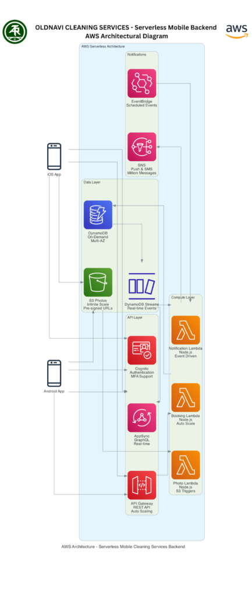

***Arthurite Integrated SMB Competency***

Traditional service businesses face existential threats from app-based competitors. Oldnavi Cleaning Services, a Lagos-based commercial and residential cleaning company, watched newer competitors capture market share with mobile booking, real-time tracking, and instant payments—features their phone-based operation couldn't match.

**The Challenge**

Operating with manual phone bookings and paper schedules, Oldnavi struggled with inefficient routing that wasted 15+ hours weekly on logistics. Cash and check payments created cash flow problems, with 25% of invoices overdue beyond 30 days. Without mobile capabilities, they couldn't compete for lucrative corporate contracts requiring digital service validation. The company faced a difficult choice: invest heavily in custom software development or concede the market to tech-enabled competitors.

**The Solution**

Arthurite Integrated implemented a fully serverless AWS architecture, eliminating all infrastructure management while providing enterprise-grade mobile capabilities at startup pricing. Amazon API Gateway provides the mobile API layer with built-in authentication and rate limiting. AWS Lambda functions (Node.js) handle all business logic—booking management, route optimization, payment processing, and notifications—scaling automatically without servers.

Amazon DynamoDB with on-demand billing stores all application data, eliminating capacity planning. Amazon Cognito manages user authentication for customers and staff, while AWS AppSync provides GraphQL APIs for real-time job status updates via WebSocket. Before/after service photos upload directly to S3 using pre-signed URLs, with Lambda functions generating thumbnails automatically. Amazon SNS handles push notifications and SMS, while EventBridge orchestrates scheduled reminders.

The serverless architecture means zero servers to manage, patch, or scale. Everything scales automatically from zero to thousands of concurrent users based on actual demand, with costs scaling proportionally.

**The Results**

The transformation's financial impact was immediate. Average payment collection time dropped from 38 days to 6 days through digital payments, dramatically improving cash flow. Late payment rates fell from 25% to 4%. Operational efficiency improved by 80%, reducing scheduling time from 15 to 3 hours weekly, enabling 61% more clients with the same administrative team. Route optimization reduced fuel costs by 28%.

The mobile app achieved 38% customer adoption within 9 months, with mobile bookings representing 22% of revenue. The serverless architecture costs approximately $1,000 monthly—compared to $3,000+ for equivalent EC2-based infrastructure—with zero infrastructure management overhead.

**Key Takeaways for SMBs**

Oldnavi's serverless success demonstrates that digital transformation is accessible to traditional businesses:

- Serverless architectures democratize enterprise technology for SMBs
- Pay-per-use pricing aligns costs with business growth
- Zero infrastructure management eliminates technical staffing needs
- Mobile capabilities become competitive requirements, not luxuries

For service businesses—cleaning, logistics, field services, maintenance—serverless AWS architectures provide the mobile-first experiences customers expect at costs traditional SMBs can afford, without requiring technical expertise or infrastructure management.
