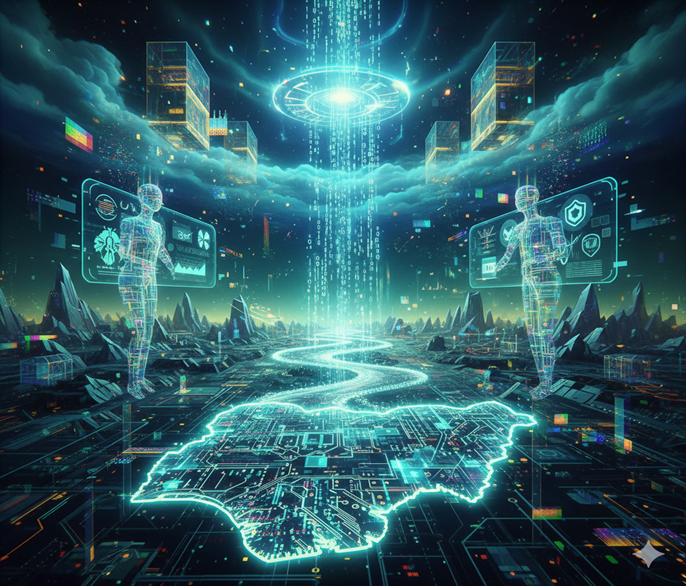

Imagine a CEO staring at a blinking server rack in a dimly lit office. Every minute of downtime costs revenue, frustrates customers, and shakes confidence. Meanwhile, a startup founder struggles to deploy her AI idea because servers crash under demand. A bank’s IT leader knows cloud adoption is crucial but lacks the strategy, skills, and infrastructure guidance to make it happen.

This *used to be the story* of digital transformation in Nigeria.

Today, that narrative is changing  fast.

Thanks to expanding cloud infrastructure, surging AI adoption across industries, and rising global investment in cloud-powered innovation, businesses are no longer held back by legacy systems or fragmented tech strategies. And at the heart of this transformation stands a partner businesses can trust: **Arthurite Integrated, an AWS Advanced Tier Partner with expertise in cloud computing, Artificial Intelligence (AI), security, and digital strategy.**

**A Digital Shift You Can’t Ignore**

**Nigeria is leading the way in AI adoption and cloud innovation.** According to a recent global report, Nigeria’s AI use jumped dramatically, with **88% of adults using AI tools for learning and work far above the global average**. This isn’t hype; it’s real technology shaping everyday businesses and workflows.

At the same time, Nigeria is rapidly building out digital infrastructure to support this growth. New hyperscale data centres and cloud ecosystem investments including Nigeria’s first 100 MW AI-ready data facility in Lagos signal a future where **compute-intensive applications and AI workloads will run locally with speed and reliability**.

Across Africa and beyond, enterprises are shifting major workloads to cloud platforms to improve agility and cut costs, while major tech players accelerate partnerships to expand cloud and AI adoption for regulated and fast-growing industries.

This evolving environment presents both opportunity and complexity and that’s exactly where Arthurite Integrated adds massive value.

**More Than Cloud Migration A Complete Digital Transformation Partner**

Arthurite isn’t just a vendor, it’s a **strategic partner** that helps organizations adopt emerging technologies with impact and clarity. Whether you’re a startup scaling fast or a large enterprise navigating AI, cloud, and data challenges, Arthurite crafts solutions that work, not just tech for tech’s sake.

Here’s how:

**1. Cloud Architecture & Migration From Risk to Resilience**

Many organizations know that moving to the cloud reduces costs and improves performance, but *how* it’s done determines success.

Arthurite:

- Plans and executes secure cloud migrations
- Modernizes legacy systems for agility and scale
- Implements hybrid and multi-cloud strategies
- Ensures business continuity during transformation

**Cloud isn’t about lifting and shifting, it’s about unlocking adaptability and uptime.**

**2. AI & Generative AI (GenAI) Solutions Intelligent Systems with Purpose**

As AI becomes integral to customer service, analytics, automation, and decision support, Arthurite helps businesses:

- Build smart AI assistants and chatbots
- Integrate GenAI into workflows and customer engagement
- Leverage data insights for predictive decisions
- Implement AI-powered analytics for deeper business understanding

AI adoption in Nigeria is rising because the technology isn’t just futuristic, it’s practical, transforms engagement, and unlocks insights that fuel growth.

**3. Cybersecurity & Compliance Protecting What Matters Most**

Digital transformation without strong security is like building a skyscraper without a foundation.

Arthurite works on:

- Secure cloud governance
- Identity and access management
- Data protection and compliance frameworks
- Proactive threat monitoring

This isn’t optional,  it’s essential for trust and continuity in today’s digital economy.

**4. Data Analytics & Business Intelligence Smarter Decisions, Faster**

Data alone doesn’t drive results , insight does.

Arthurite’s data specialists help businesses:

- Build data lakes and analytics platforms
- Derive real-time insights to guide strategy
- Integrate BI tools for performance measurement
- Automate reporting across departments

This empowers leaders with **data-driven decisions** that outperform intuition alone.

**5. Training & Enablement Building Tomorrow’s Tech Leaders Today**

Transformation doesn’t just happen,  it’s *adopted*. Arthurite helps teams get there:

- Upskilling technical teams on cloud and AI workflows
- Training for best practices and innovation adoption
- Workshops aligned with real business use cases

This ensures companies don’t just deploy tech,  they *own* it.

**Real Progress in the Nigerian Tech Landscape**

Nigeria’s rise in AI readiness, climbing over 30 places globally in recent indexes isn’t accidental. A mix of private-sector innovation, government policy alignment, and growing skills ecosystems is driving real change.

From entrepreneurs using AI for creative problem solving, to enterprises migrating entire systems to cloud platforms, digital transformation in Nigeria is underway.

But transformation doesn’t happen by chance,  it happens by design.

And that’s Arthurite’s mission.

**A Partner for Every Stage of Your Journey**

Whether you’re:

- Launching a new cloud initiative
- Integrating AI into core business operations
- Strengthening cybersecurity postures
- Scaling systems to handle greater demand
- Training teams for digital leadership

Arthurite Integrated stands ready, not as a vendor, but as a **trusted guide.**

With deep expertise, practical solutions, and visionary execution, Arthurite helps organizations convert complexity into capability.

**Let’s Build Your Future Together**

In a world where technology changes faster than board strategies can keep up, your choice of a technology partner matters.

Don’t just survive digital disruption, **lead it**.

**Arthurite Integrated**, where cloud meets strategy, AI meets business outcomes, and transformation becomes tangible.
