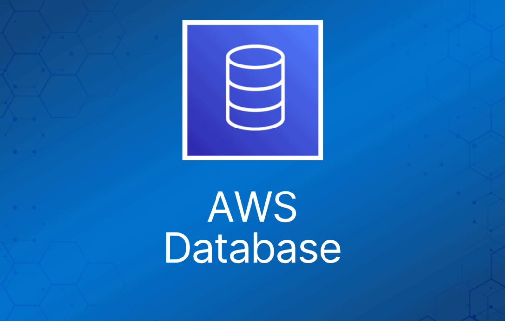

**By: Adekunle Kehinde Fisayo** | Web Engineer, Arthurite Integrated | AWS Advanced Tier Partner

Choosing the right database is one of the most important decisions when building an application. The wrong choice can lead to performance issues, higher costs, and scalability limitations as your business grows.

Two of the most common types of databases today are **relational (SQL)** and **non-relational (NoSQL)** databases. Each serves a different purpose, and understanding when to use one over the other can save you time, money, and future headaches.

In this article, we’ll break down the differences, explore real-world use cases, and show how modern cloud platforms like Amazon Web Services make database management easier than ever.

### What is a Relational Database?

A relational database organises data into structured tables made up of rows and columns. These tables can be linked using relationships, making it easy to maintain consistency and integrity across your data.

Relational databases use **SQL (Structured Query Language)** and are best suited for applications that require accuracy and consistency.

### Key Characteristics:

- Fixed schema (structured data)
- Strong data consistency (ACID compliance)
- Supports complex queries and relationships

### Common Use Cases:

- Banking and financial systems
- E-commerce platforms
- Inventory and order management systems

With AWS, services like Amazon RDS and Amazon Aurora allow businesses to deploy and manage relational databases without worrying about infrastructure.

### What is a Non-Relational (NoSQL) Database?

Non-relational databases, also known as NoSQL databases, are designed for flexibility and scalability. Instead of rigid tables, they store data in formats like key-value pairs, documents, or graphs.

This makes them ideal for handling large volumes of unstructured or rapidly changing data.

### Key Characteristics:

- Flexible or dynamic schema
- High scalability (horizontal scaling)
- Optimized for speed and large datasets

### Common Use Cases:

- Real-time applications (chat apps, live feeds)
- Big data and analytics
- IoT and event-driven systems

A popular AWS service in this category is Amazon DynamoDB, which provides fast and predictable performance at scale.

## **Relational vs Non-Relational Databases: Key Differences**

| Feature | Relational (SQL) | Non-Relational (NoSQL) |
| --- | --- | --- |
| Data Structure | Tables (rows & columns) | Flexible (JSON, key-value, etc.) |
| Schema | Fixed | Dynamic |
| Scalability | Vertical | Horizontal |
| Consistency | Strong | Eventual (in most cases) |
| Best For | Structured data & transactions | Large-scale, flexible data |

## **When Should You Use Each?**

Understanding the right use case is key.

### Use Relational Databases When:

- Your application requires **high data accuracy**
- You’re handling **transactions (payments, orders)**
- Your data structure is **well-defined and stable**

### Use NoSQL Databases When:

- Your application needs to **scale quickly**
- You’re working with **unstructured or evolving data**
- You need **real-time performance at scale**

In many modern architectures, businesses actually use **both**, leveraging the strengths of each depending on the workload.

### **AWS Database Solutions at a Glance**

One of the biggest advantages of using Amazon Web Services is the wide range of fully managed database services available.

Here are a few key ones:

- Amazon RDS → Simplifies SQL database setup and maintenance
- Amazon Aurora → High performance and scalability
- Amazon DynamoDB → Serverless NoSQL with automatic scaling
- Amazon ElastiCache → Improves application speed with caching

These services remove the burden of infrastructure management, allowing businesses to focus on building and scaling their applications.

### **Where Most Businesses Get It Wrong**

Despite the availability of powerful tools, many businesses still struggle with:

- Choosing the wrong database type
- Poor database design and architecture
- Unexpected cloud costs due to inefficient configurations
- Security and access misconfigurations

These issues can lead to performance bottlenecks and unnecessary expenses over time.

### **How Arthruite Integrated Can Help**

At Arthruite Integrated, we help startups, SMEs, and individuals make the right database decisions from the start.

Our services include:

- Database architecture design tailored to your application
- Deployment and provisioning on AWS
- Performance optimization and scaling strategies
- Cost management and monitoring
- Ongoing maintenance and support

Whether you’re building a new application or optimising an existing one, we ensure your database is secure, scalable, and cost-effective.

### **Conclusion**

There is no one-size-fits-all solution when it comes to databases. The right choice depends on your application’s needs, scalability goals, and data structure.

Relational databases provide consistency and reliability, while non-relational databases offer flexibility and scale. Understanding when to use each can give your business a strong technical foundation.

If you’re unsure where to start or need help optimising your database infrastructure, working with an experienced AWS partner can make all the difference.
