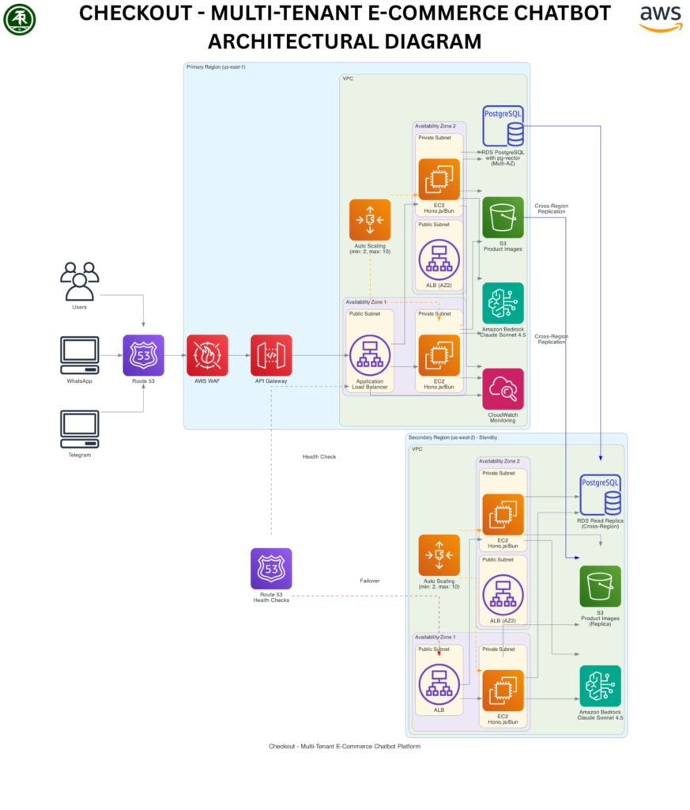

***Customer Reference***

How Checkout turned WhatsApp and Telegram into a high-converting sales channel for SMB and enterprise retailers — powered by Amazon Bedrock on AWS.

E-commerce has a conversion problem. Customers arrive, browse, ask questions — and leave. Not because they didn't want to buy. Because nobody was there to help them at the moment it mattered. Checkout was built to fix that.

## About the Client: A SaaS Platform Reimagining Where Commerce Happens

The client is a technology solutions provider that builds multi-tenant SaaS platforms enabling businesses to sell directly through messaging applications. Rather than directing customers to traditional web storefronts with complex navigation, checkout processes, and cart abandonment at every step, the platform brings the entire commerce experience into WhatsApp and Telegram — where customers already spend their time.

The client serves both SMB retailers seeking to compete with larger platforms and enterprise retailers looking to diversify their sales channels into high-engagement messaging platforms. Their common challenge: building conversational commerce at scale requires AI that can handle thousands of simultaneous customer conversations with product knowledge, contextual memory, and real-time decision-making.

## The Challenges: Why Traditional E-Commerce Fails the Modern Buyer

- **Delayed Engagement** — Response times of hours to days on customer enquiries. By the time a human replied, the customer had already bought elsewhere.
- **60%+ Cart Abandonment** — Complex navigation, unclear product information, and no real-time assistance drove more than half of all shopping sessions to abandonment before purchase.
- **Fragmented Channels** — Managing product information, inventory, and customer conversations across web, social, and messaging platforms was operationally unsustainable.
- **No Personalisation** — No contextual memory across interactions. Every conversation started from zero, with no upselling intelligence or continuity from previous sessions.
- **Scalability Ceiling** — Scaling revenue required scaling headcount proportionally. The model had no path to efficient growth without continuous hiring.
- **Business Hours Only** — Sales restricted to when human agents were available. Every evening, weekend, and public holiday was revenue left on the table.

## The Solution: Checkout — Commerce That Closes

Arthurite Integrated partnered with the client to architect and deploy Checkout as a production-grade AI-powered commerce platform on AWS. The platform handles the complete customer journey — product discovery, enquiry, recommendation, order placement, and payment — entirely within WhatsApp and Telegram conversations, with no app download or web navigation required.

### Conversational Product Discovery

Powered by Amazon Bedrock with Claude Sonnet 4.6, Checkout understands natural language product queries — handling vague descriptions ("something for my mum's birthday under ₦15,000"), specific searches, and comparison requests with equal fluency. Product knowledge is maintained in Amazon RDS with pg-vector for semantic search, ensuring results are contextually relevant rather than keyword-matched.

### Intelligent Upselling and Recommendations

Checkout's recommendation engine analyses the customer's cart, browsing history, and stated preferences to suggest complementary products and higher-value alternatives at the natural moment in conversation — not via a pop-up interruption, but as part of a helpful dialogue. This contextual intelligence drives the 25% increase in average revenue per customer achieved by early implementations.

### Seamless Order Completion in Chat

Customers confirm orders, select delivery options, and initiate payment without leaving the messaging application. The entire commerce flow — discovery, selection, confirmation, payment, and order receipt — happens in a single conversation thread. Sub-3-second average response times maintain the cadence of a real conversation, not a form submission.

> "The 42% reduction in cart abandonment is not a UX metric. It is proof that when you remove friction and add responsiveness, customers buy."

## Technology: Enterprise-Grade Infrastructure for Conversational Commerce

Checkout runs on production AWS infrastructure designed for the scale, reliability, and latency demands of real-time commerce. EC2 Auto Scaling ensures the platform handles 10,000+ concurrent users without performance degradation. Multi-region architecture delivers 99.9% availability across time zones.

- Amazon Bedrock (Claude Sonnet 4.6)
- Amazon RDS + pg-vector
- EC2 Auto Scaling
- Amazon S3
- AWS WAF
- Amazon Route 53
- Amazon CloudWatch
- Amazon API Gateway
- WhatsApp Business API
- Telegram Bot API

AWS WAF provides application-layer security, blocking injection attempts and abuse patterns. Route 53 manages global routing with health-check failover ensuring availability across regions. CloudWatch provides real-time operational visibility across all platform components.

## The Results: What Conversational Commerce Actually Delivers

|  |  |
| --- | --- |
| **42%** | Reduction in cart abandonment through 24/7 AI engagement |
| **30%** | Higher conversion rates via contextual upselling and intelligent recommendations |
| **25%** | Increase in average revenue per customer from AI-personalised product suggestions |
| **3.5×** | Faster response times vs. human-led support (sub-3-second average) |
| **55%** | Operational cost savings as AI handled 80%+ of pre-sale enquiries |
| **90%** | Positive AI response ratings from customers across early implementations |

## Strategic Significance: A New Default for E-Commerce

Checkout represents a fundamental shift in the architecture of retail commerce. The assumption that e-commerce requires a website, a checkout page, and a shopping cart is not a law of nature — it is a design convention that was built before messaging platforms became the primary communication layer of the internet.

By building commerce where conversation already happens, Checkout eliminates every point of friction in the traditional purchase journey. No new app. No account creation. No navigation. Just a conversation that ends in a purchase.

For the client's retail customers, this means competing on a level playing field with the largest e-commerce platforms in the world — with the personal touch of a small business and the operational efficiency of enterprise automation. Powered by Arthurite Integrated and built on AWS.
