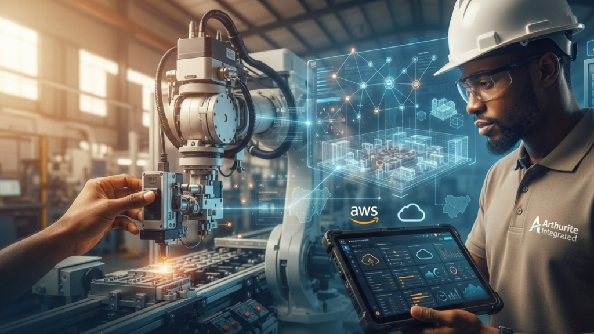

The AI-in-the-browser era is defined by generations creating text, code, or images. But the next wave of industrial maturity is defined by operation using intelligence to optimize the physical world.

# The Shift from "Generation" to "Operation"

Think about the industries that form the backbone of the Nigerian economy: manufacturing, logistics, and energy. These sectors don’t just need a better chatbot; they need systems that can "see" and "react" to physical conditions in real-time. This is where the Industrial Internet of Things (IIoT) meets the cloud.

By integrating physical sensors, temperature monitors on a power transformer, humidity sensors in a greenhouse, or vibration monitors on a production line with AWS-powered cloud infrastructure, we are no longer just collecting data. We are building systems that can predict when a machine will fail before it actually breaks.

# Why This Matters: The "Arthurite" Approach

At Arthurite Integrated, we see this transformation firsthand. When we work with partners in sectors like manufacturing and distribution, the objective isn't just to move their data to the cloud. It’s to use that cloud footprint as a foundation for intelligence.

Consider a factory moving from reactive maintenance, fixing machines only after they stop, to predictive maintenance, where the system tells the operator exactly when to lubricate a bearing to prevent a three-day shutdown. That shift isn't powered by a prompt in a chatbot. It’s powered by a robust AWS architecture that processes streams of sensor data at the edge, identifies anomalies, and triggers an automated response.

# The Real AI Revolution is Physical

This transition is critical for the Nigerian market for three reasons:

1. Reduced Downtime: In an economy where efficiency is tied directly to the bottom line, preventing a single day of unplanned downtime for a manufacturing plant or a retail logistics chain is worth more than a thousand AI-generated emails.

2. Asset Longevity: By keeping machines running within optimal parameters, we extend the lifespan of expensive physical infrastructure, protecting capital investments.

3. Local Competitiveness: Adopting these technologies allows local enterprises to reach global standards of operational efficiency, making them more resilient to supply chain shocks and market volatility.

# Looking Ahead

As we navigate the rest of 2026, the question for business leaders shouldn't be, "How can I use AI to write my content?" The more strategic question is, "Where are the physical bottlenecks in my operation that could be solved by real-time, data-driven intelligence?"

The revolution is moving beyond the screen. It is heading into the warehouse, the generator room, and the field. At Arthurite, we’re proud to be building the infrastructure that makes this possible, not just helping businesses "talk" to the future, but helping them build it, one sensor and one cloud instance at a time.

Is your operational infrastructure ready for the next level of intelligence? Let’s talk about building what’s next. Contact Arthurite Integrated for a consultation.
