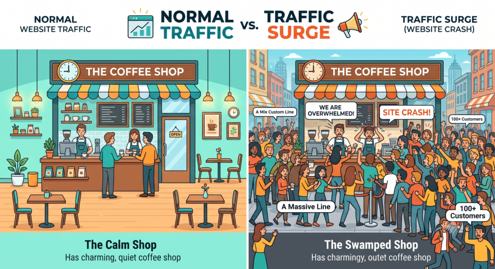
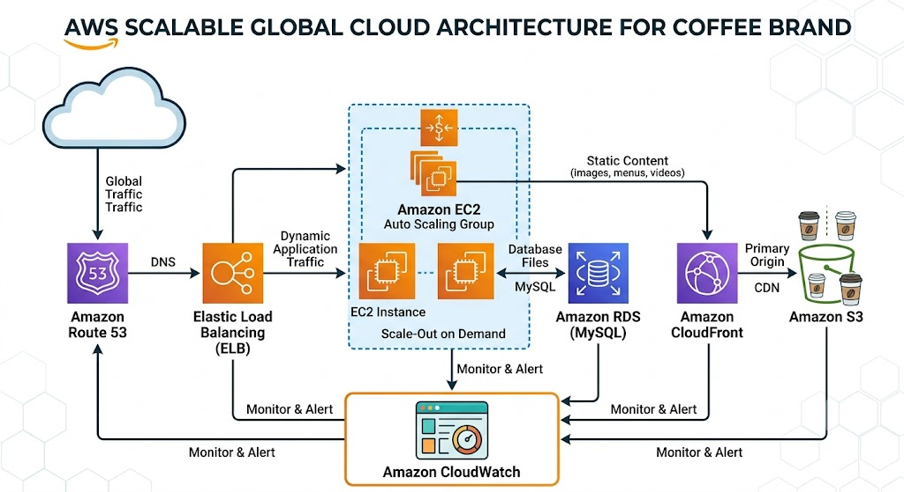

**By: Adekunle Kehinde - Web Engineer**

Imagine this scenario:  
Your business gets featured by a popular influencer with millions of followers. Or maybe your product is mentioned on national TV. Within minutes, thousands of people rush to your website, eager to learn more or buy.  
Sounds like the dream, right? **Not always.**  
For many businesses, going viral is the exact moment their website dies. Pages stop loading, checkouts fail, and potential customers bounce forever. What should have been a record-breaking day turns into a costly nightmare.

## Why Websites Crash During Traffic Spikes

To understand why websites crash, think of your site like a small local coffee shop with only two baristas.

On a normal day, they serve customers quickly and efficiently.

Now imagine a tour bus pulls up with **500 hungry customers** all asking for complex lattes at the exact same second. The shop hasn't changed—it simply wasn't designed for that sudden surge.

Websites work the same way. Every visitor uses up resources like CPU, memory, storage, and network bandwidth. Too many requests at once? Everything grinds to a halt.

## The Myth: "I Just Need a Bigger Server!"

> **Myth:** *Upgrading to a larger, more expensive server solves all traffic problems.*
>
> **Reality:** *A bigger server is just a bigger coffee shop. If demand keeps growing, even giant servers hit a hard limit.*

Modern cloud architecture takes a completely different approach. Instead of relying on one super-powered machine, it distributes traffic across multiple resources that automatically **stretch and shrink** based on real-time demand.

That’s where **Amazon Web Services (AWS)** comes in.

## Interactive Breakdown: Meet Your Website’s AWS Dream Team

Handling viral traffic isn't a one-man job. See how these AWS services team up to keep your site online when traffic explodes:

- **What it does:** Directs incoming visitors evenly across multiple servers so no single server gets overwhelmed.
- **Why it matters:** If one server fails under pressure, ELB instantly redirects visitors to healthy ones. No crashes, no error screens.

- **What it does:** Automatically adds extra server capacity during traffic surges and removes it when demand slows down.
- **Why it matters:** Like hiring temporary staff during peak hours—you get maximum power when you need it and only pay for what you use.

- **What it does:** Stores heavy files like high-res images, videos, and PDFs away from your primary web application.
- **Why it matters:** Keeps your core servers free to process fast, high-value tasks—like processing customer checkouts.

- **What it does:** Delivers your website's content from global servers closest to where your visitors live.
- **Why it matters:** Speeds up loading times globally and absorbs up to 80% of incoming traffic before it ever hits your main servers.

- **What it does:** Monitors CPU load, speed, and overall site health 24/7 in real time.
- **Why it matters:** Detects issues instantly and alerts your team *before* a minor performance dip turns into a public crash.

## Real Businesses Experience Traffic Spikes Every Day

You don't need to be Amazon or Netflix to experience a surge. A sudden wave of visitors often happens when:

- An influencer randomly tags your product in a reel.
- You launch a flash sale or seasonal promo.
- A major news outlet or industry blog links to your site.
- A viral marketing campaign performs *too* well.

> **Did You Know?** A single minute of downtime during peak shopping events can cost businesses thousands of dollars in lost revenue—not to mention permanent brand damage.

## The True Cost of Being Unprepared

When your site crashes during a viral surge, the damage goes deeper than lost sales for the day:

| **What You Expect** | **What Actually Happens** |
| --- | --- |
| **New Customers** | Frustrated visitors who leave in 3 seconds |
| **Increased Revenue** | Broken checkout carts and abandoned items |
| **Brand Recognition** | Angry social media posts about your site being down |

Scalable cloud architecture isn't an expense—it's **insurance for your growth**.

## Ready to Viral-Proof Your Website?

At **Arthruite Integrated**, we build and optimise cloud infrastructure designed for absolute reliability, performance, and scalability.

Whether you're gearing up for a major product launch or just want peace of mind knowing your site can handle anything, we’ve got your back.

👉 **[Schedule a Cloud Readiness Audit with Arthruite Integrated Today](https://arthuriteintegrated.com/)**
