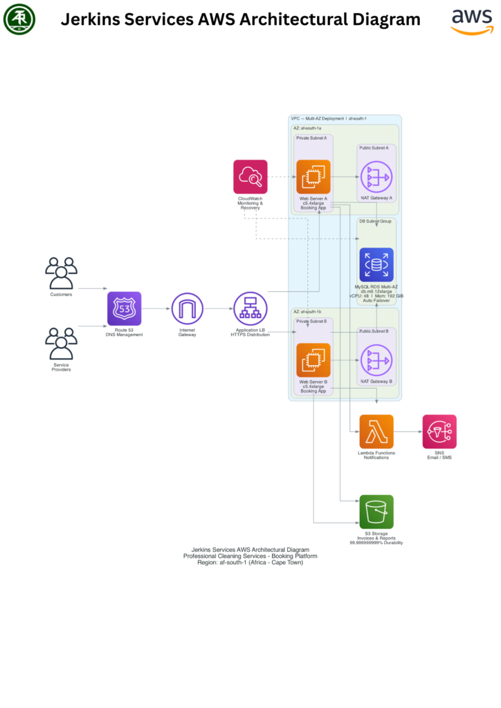

There's a particular kind of dread that comes with running a cleaning and facilities business off a spreadsheet. It's the moment two clients get booked for the same technician at the same hour. It's the server going down on a Monday morning with forty jobs scheduled and no way to see them. It's the phone call from a client asking where their crew is — and not having an answer.

For Jerkin Services, a professional cleaning and facility management company in Lagos, that dread wasn't occasional. It was Tuesday.

## A Business Running Faster Than Its Own Systems

Jerkin Services had built something real: a growing client base, a reputation for reliability, a team that showed up. What it hadn't built — because no one budgets for this until it breaks — was infrastructure that could keep up with its own success.

The booking system lived across paper, spreadsheets, and whatever combination of tools happened to be open that day. There was no single source of truth for who was booked where. The on-premises server that held it all together failed often enough that staff learned to expect it — more than 20 hours of downtime a month, at unpredictable moments, with no way to access schedules or customer records while it was out.

The math was brutal in a way that's easy to describe and painful to live through: a 12% double-booking rate. Every double-booking meant an apology, a scramble, sometimes a lost client. Leadership had no real-time view into utilization or route efficiency — just a sense, week to week, that the business was capped not by demand but by its own back office.

## Rebuilding the Foundation, Not Just Patching the Cracks

Jerkin Services brought in Arthurite Integrated with a mandate that was simple to state and hard to deliver: make the booking system something the business could actually trust, and build it to grow.

The answer was a cloud-native booking and dispatch platform on AWS, architected for the two things a business like this can't compromise on — reliability and a single, real-time source of truth. An Application Load Balancer distributes traffic across EC2 instances running in two Availability Zones, so no single server failure can take the platform down. Amazon RDS for MySQL runs Multi-AZ with automatic failover, meaning the database that holds every booking and every customer record has a live backup ready to take over in under a minute if anything goes wrong. A Lambda-and-SNS notification layer handles booking confirmations and reminders automatically — no more manual follow-ups falling through the cracks.

The architecture below shows how it all fits together: a load-balanced, multi-AZ application tier backed by a self-healing database layer, with notifications and document storage running independently alongside the core booking flow.

Every piece of that design maps directly back to what was actually breaking: no more single point of failure, no more silent booking conflicts, no more "let me check and call you back."

## What Changed

The numbers tell a story that Jerkin's team lived through in real time, month by month:

- Uptime climbed from 92% to 99.95% — the kind of shift that turns "the server's down again" from a recurring sentence into something that essentially stopped happening

- Double-booking dropped to zero in the platform's first year of production, down from a 12% error rate under the old process

- Administrative time fell 79% — from 12 hours a week spent wrestling with scheduling to 2.5, freeing staff to actually talk to customers instead of chasing paperwork

- Booking volume grew 60%, from 150 to 240 jobs a day, without adding a single person to the admin team to handle it

- Customer satisfaction rose from 78% to 93%

- Roughly $54,000 in previously lost revenue was recovered in Year 1 — money that had been quietly leaking out through downtime and double-bookings before the platform ever existed

## Growth Without the Growing Pains

The real shift wasn't any single metric — it was what stopped happening. No more 3 AM anxiety about whether the server would be up on Monday. No more double-bookings that needed damage control. No more growth that required hiring just to keep the wheels from coming off.

Jerkin Services is now working toward a target of 500+ active clients, on infrastructure that was built to get there — not one it will have to outgrow and rebuild all over again.

"We used to run this business bracing for the next thing to break. Now we plan for growth instead of firefighting outages. That's a completely different way to run a company," says the Operations Lead at Jerkin Services.

---

Jerkin Services' platform was designed and delivered by Arthurite Integrated on AWS. To learn how a cloud-native foundation could help your business stop firefighting and start scaling, send an email to [info@arthuriteintegrated.com](mailto:info@arthuriteintegrated.com).
