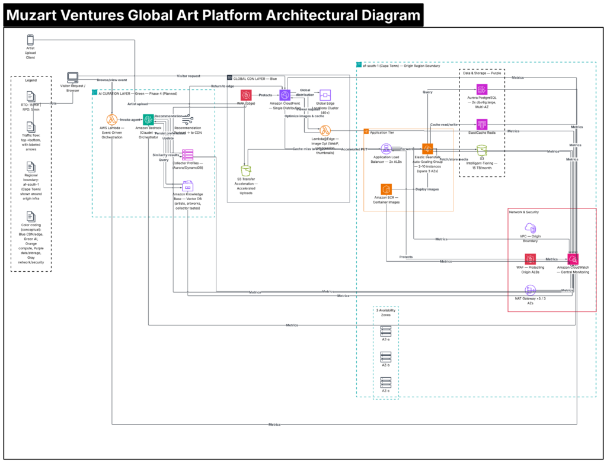

Picture the worst possible moment for a website to crash: the exact hour your highest-revenue event of the quarter goes live, traffic pours in from six continents, and the page takes twelve seconds to load — if it loads at all.

That wasn't a hypothetical for Muzart Ventures. It was Tuesday afternoon, more than once.

## **A Global Audience, a Local Server**

Muzart Ventures had built something genuinely rare: a digital art gallery and virtual exhibition platform connecting over 1,200 African artists with more than 45,000 art enthusiasts around the world. The demand was real. The art was extraordinary. The infrastructure was not ready for either.

Every visitor, no matter where they were browsing from — Lagos, London, Los Angeles — was being served from a single on-premises location. For a platform built almost entirely on high-resolution artwork and media-rich virtual exhibitions, that meant page loads of 8 to 12 seconds for international visitors. Nearly half of them — 42% — simply left before the page finished loading.

And it got worse exactly when it mattered most. Virtual exhibitions, the platform's biggest revenue events, generated traffic spikes the infrastructure couldn't absorb. The site crashed under the load. High-profile exhibitions were postponed. Artists — the lifeblood of the platform — started looking at competitors with smoother digital experiences. All of this while the business paid for infrastructure that couldn't keep up with the audience it had already earned.

## **Global Reach, African Roots**

Muzart Ventures had one requirement that couldn't be compromised: artist data and content needed to stay in Africa. Any solution that meant moving infrastructure overseas, or duplicating sensitive data outside the continent, was off the table before the conversation even started.

Working with Arthurite Integrated, Muzart Ventures rebuilt its platform around a simple principle: serve the world from the edge, keep the data at home. Amazon CloudFront now distributes content from more than 40 edge locations worldwide, while the origin infrastructure stays firmly in af-south-1, Cape Town. AWS Lambda@Edge optimizes every image in real time — converting formats, compressing files, generating thumbnails — cutting bandwidth by 60% before it ever reaches a browser. Behind the scenes, Elastic Beanstalk auto-scales the application tier from 2 to 10 instances the moment traffic spikes, so the next big exhibition launch doesn't stand a chance of taking the site down.

The architecture tells its own story: a global edge layer handling delivery and optimization, an auto-scaling origin in Cape Town handling the workload, and a strict boundary between the two that keeps every piece of artist and collector data inside African infrastructure.

The result is an architecture where a visitor in Toronto gets images optimized and delivered from a server near them — while the actual artist data, exhibition records, and collector information never leave African soil.

## **What Changed**

The shift showed up everywhere the old bottlenecks used to be:

- **Page load time dropped from 8.2 seconds to 1.7 seconds globally** — and under 1 second for visitors within Africa
- **Visitor abandonment fell from 42% to just 8%**
- **Conversion rate increased by 280%**, directly tied to the platform finally being fast enough to keep people on the page
- **The platform sustained 99.96% uptime across 15 virtual exhibitions**, including the very traffic spikes — up to 12x normal load — that used to bring the site down
- **User satisfaction rose from 65% to 92%**
- **Cost per active user dropped from $2.33 to $0.79**, even as the platform absorbed dramatically more traffic and a much larger user base than before

## **An Exhibition That Actually Happens**

The most telling number might be the simplest one: 15 virtual exhibitions hosted since launch, with zero service interruptions. Not "mostly stable." Not "usually fine." Zero.

For a platform whose entire business model depends on the biggest moments going right, that's not a footnote — it's the whole point. Muzart Ventures set out to prove that an African digital business could compete globally without sacrificing data sovereignty. Fifteen exhibitions in, with a recommendation engine built on Amazon Bedrock now in the works to help collectors discover the right artists faster, that proof is holding up.

"Our artists trusted us to keep their work — and their data — in Africa. We needed a way to go global without breaking that trust, and that's exactly what we got," says the Platform Lead at Muzart Ventures.

---

*Muzart Ventures' platform was designed and delivered by Arthurite Integrated on AWS. To learn how a globally distributed, Africa-rooted architecture could help your business scale without compromise, get in touch.*
