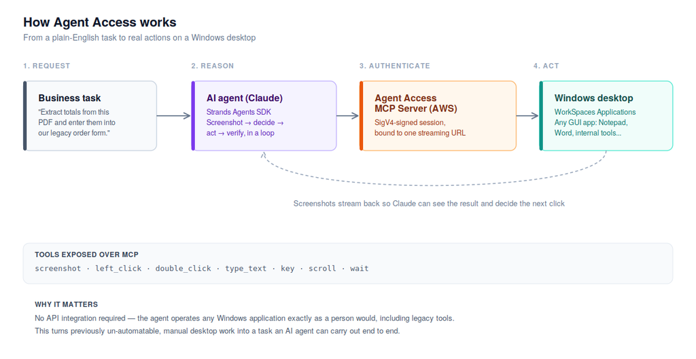

**Teaching AI to Use a Mouse: What AWS’s Agent Access Means for Desktop Automation**

*How AWS's WorkSpaces Agent Access lets AI agents operate any Windows application, and where the approach could add real business value.*

Most of the AI automation we use today depends on something that is easy to overlook: an API.

Slack has an API. Salesforce has an API. Internal business systems often have APIs. That clean, programmatic interface is what allows software to send data, trigger actions, and connect one system to another. It is also the assumption behind many AI integration projects: somewhere, there is a reliable programmatic door in.

But much of the software organizations rely on does not have that door.

Legacy Windows applications, desktop-only vendor tools, and business systems whose only interface is a screen, keyboard, and mouse have traditionally been difficult to automate. The problem is not necessarily that the workflows are complicated. In many cases, they are repetitive tasks that a human can complete simply by looking at the screen and clicking through a series of steps. The challenge is giving software the ability to interact with those applications in the first place.

That is what makes AWS’s Agent Access capability interesting.

On June 30, 2026, AWS [announced General Availability of AI agent access to Amazon WorkSpaces Applications](https://aws.amazon.com/blogs/desktop-and-application-streaming/amazon-workspaces-now-lets-ai-agents-operate-desktop-applications/). The capability allows an AI agent, such as Claude, to interact with a Windows desktop through visual feedback and familiar computer actions, including taking screenshots, clicking, typing, scrolling, and pressing keys, without requiring the underlying application to expose an API.

AWS has also released a companion [sample repository](https://github.com/aws-samples/sample-code-for-workspaces-agent-access) containing working examples that demonstrate how this approach can be used for tasks such as extracting information from documents into desktop applications, validating application workflows, running validation across multiple sessions, and combining desktop interaction with other tools.

This changes the question from **“Does this application have an API?”** to a more interesting one:

**“If a person can complete the workflow through the application's interface, can an AI agent do the same?”**

This article explores how AWS Agent Access works, what the accompanying sample demonstrates, and where this approach could realistically add value for organizations looking to automate desktop-based workflows.

**The Problem: Software Without APIs**

Every organization accumulates software that was never designed for modern automation.

It might be a legacy Windows application that has been running for years, a desktop tool provided by a vendor, or an internal system that was built long before APIs became the standard way for applications to communicate. These systems can remain critical to day-to-day operations even when they have little or no programmatic interface.

The result is a familiar pattern: employees perform repetitive tasks manually because there is no practical way for another system to interact with the application.

Consider a few examples:

- Re-entering information from one system into another.
- Opening a desktop application and performing the same multi-step validation process after every update.
- Copying information from documents into a legacy Windows form.
- Running repetitive checks across multiple desktop application sessions.

None of these tasks necessarily require complex decision-making. A person can often complete them by following a predictable sequence of visual actions. Yet automating them traditionally means finding an API, building an integration, working with a vendor, or modifying an application that an organization may not want to touch.

For some systems, the cost and effort of doing that simply outweigh the benefit of automation.

AWS Agent Access approaches the problem from a different direction.

Instead of asking an application to expose a new programmatic interface, the AI agent interacts with the interface that already exists. It can observe the desktop, determine what action to take, and use familiar computer interactions such as clicking, typing, scrolling, and pressing keys.

In other words, the application does not necessarily need to learn how to communicate with the AI agent. **The agent learns how to interact with the application.**

That shift is what makes desktop-based AI automation worth exploring, not as a replacement for well-designed APIs, but as a potential option for workflows where APIs do not exist or are impractical to build.

# **How it works**

At a high level, four things are involved: a task described in plain English, an AI agent that decides what to do, an AWS service that carries out those actions, and the actual Windows desktop being controlled.

*Agent Access architecture: from a business task through the AI agent and AWS's MCP server, to the Windows desktop.*

Walking through it left to right:

**1. The request.** Someone describes a task in plain English, “extract the totals from this PDF and enter them into our order form.”

**2. The agent reasons.** Claude, running via the open-source [Strands Agents SDK](https://strandsagents.com/), takes a screenshot of the desktop, decides on the next action, and repeats: screenshot, decide, act, verify, until the task is done. This loop is the entire mechanism; there's no special understanding of any particular application, just visual perception and standard mouse/keyboard actions.

**3. Authentication.** Every action is sent over a [Model Context Protocol (MCP)](https://modelcontextprotocol.io/) connection, signed with AWS credentials (SigV4) and scoped to one specific desktop session via a short-lived streaming URL. This is what keeps the agent from being able to touch any desktop other than the one it was explicitly granted.

**4. The action.** AWS's Agent Access MCP Server translates that into a real action on a real Windows desktop running in [Amazon WorkSpaces Applications,](https://aws.amazon.com/workspaces/applications/) the same managed desktop-streaming service already used for remote application delivery.

The toolset the agent has access to is deliberately minimal: screenshot, left_click, double_click, type_text, key, scroll, and wait. That's the entire vocabulary, and it's enough, because it's the same vocabulary a human uses.

**What’s Actually in the Sample Repository?**

The AWS sample is more than an architectural diagram or a conceptual demonstration. The companion repository includes working code that shows how AI agents can interact with Windows applications through the Agent Access capability.

At its simplest, the repository includes a [quickstart](https://github.com/aws-samples/sample-code-for-workspaces-agent-access/blob/main/quickstart.py) that demonstrates the basic interaction pattern. It also provides several more complete examples that show how the approach can be applied to different types of workflows.

**PDF-to-Word Data Extraction**

One example demonstrates a workflow in which an agent extracts information from a PDF and enters the resulting data into a Microsoft Word document.

The significance of this example is not the document itself. It demonstrates the broader idea of moving information between a source and a desktop application without requiring a direct API integration between the two.

**Application Validation**

Another example uses an agent to interact with a desktop application and validate a workflow.

This provides an interesting application for software testing. Instead of having a person repeatedly navigate through the same sequence of screens after every change, an agent can perform the workflow and check whether the application behaves as expected.

**Multi-Session Validation**

The sample also demonstrates running validation across multiple desktop sessions. This opens the possibility of testing the same workflow against multiple environments or application instances in parallel.

**Agent Creator**

The repository includes an agent-creation example that can guide a user through describing a workflow and then generate an agent for that workflow.

This is particularly interesting from an automation-prototyping perspective. Rather than starting with a large engineering project, teams can first describe a repetitive workflow, generate an agent, and evaluate whether the task is a practical candidate for automation.

**MCP Tool Forwarding**

The sample also demonstrates how desktop interaction can be combined with other tools through MCP. An agent can therefore potentially interact with a Windows application while also accessing other capabilities, such as reading files or calling an internal API.

This is important because desktop automation does not have to exist in isolation. A workflow could combine traditional programmatic integrations with computer-use actions when an application does not expose the API needed for a particular step.

**From Experimentation to Production**

For experimentation, developers can run the examples from their own development environment. For more production-oriented deployments, the sample also demonstrates running agents through [Amazon Bedrock AgentCore](https://aws.amazon.com/bedrock/agentcore/) Runtime rather than relying on a developer's local machine.

The important takeaway is that AWS is providing both the desktop-control mechanism and practical examples of how it can be incorporated into broader agent workflows.

The sample does not prove that every desktop process is ready for autonomous automation. Instead, it provides a starting point for testing where computer-use agents can deliver meaningful value.

**Where Agent Access Could Make a Difference**

The most interesting question is not whether an AI agent can click a button. It is whether that capability can solve problems that have remained difficult to automate.

Agent Access is particularly interesting for workflows where applications are important to the business but lack modern APIs or require significant manual interaction.

**1. Legacy Application Automation**

Many organizations continue to depend on Windows applications that were built years ago and remain deeply embedded in their operations.

Replacing these systems may be expensive, while building custom integrations around them may not be practical. For repetitive workflows, desktop automation could provide another option.

An agent could potentially navigate the application, enter information, retrieve results, and move through a defined process using the same interface available to a human employee.

The value is not in automating a legacy application simply because it is old. The value is in reducing repetitive manual work without requiring the underlying application to be redesigned first.

**2. Regression and User Acceptance Testing**

Testing is another area where desktop interaction could be useful.

Consider a Windows application with a workflow that must be checked after every release. A tester may need to open the application, navigate through several screens, enter test data, click through a sequence of actions, and confirm that the expected results appear.

An AI agent could potentially perform these repetitive validation steps and report where the expected workflow breaks.

This does not eliminate the need for human testers. Instead, it could reduce the amount of repetitive checking they have to perform and allow them to focus more heavily on exploratory testing, edge cases, and issues that require human judgment.

**3. Cross-Application Data Transfer**

A common source of manual work is moving information between systems that were never designed to communicate with each other.

An employee may need to read information from one application and manually enter it into another. This creates both operational overhead and opportunities for human error.

Where direct API integration is unavailable or impractical, an agent that can operate both interfaces could potentially bridge that gap.

This is particularly interesting for workflows involving structured, repeatable data entry, where the steps and expected outcomes can be clearly defined.

**4. Rapid Automation Prototyping**

One of the most useful applications may be determining **whether a workflow is worth automating in the first place**.

Instead of immediately investing in a custom integration, a team could start with a small desktop workflow, describe the task, and use the sample's agent-creation approach to build an initial automation.

The resulting prototype can then be evaluated against practical criteria such as reliability, execution time, cost, and the amount of human intervention required.

This creates a faster path from **“Could we automate this?”** to **“Let's test it.”**

**5. Combining Desktop Interaction with Existing Tools**

Desktop automation does not necessarily have to replace conventional integrations.

Some workflows may involve both modern applications with APIs and older applications that can only be controlled through a graphical interface. In those cases, an agent could potentially use APIs where they are available and desktop interaction where they are not.

This hybrid approach may be more practical than attempting to force every application into the same integration model.

The broader opportunity, therefore, is not simply giving AI a mouse. It is expanding the number of systems an AI agent can participate in, from applications with well-documented APIs to applications where the graphical interface is the only practical point of interaction.

**Getting started**

The lowest-risk way to evaluate this is a small, contained pilot: pick one legacy desktop workflow that has no API today, run it through the sample's quickstart, and measure whether the reliability and cost hold up before considering anything closer to production.

# **Further reading**

- [Amazon WorkSpaces Now Lets AI Agents Operate Desktop Applications](https://aws.amazon.com/blogs/desktop-and-application-streaming/amazon-workspaces-now-lets-ai-agents-operate-desktop-applications/): AWS's official General Availability announcement, with architecture details, oversight modes, and audit-trail setup
- [aws-samples/sample-code-for-workspaces-agent-acces](https://github.com/aws-samples/sample-code-for-workspaces-agent-access)s: the companion sample repository this post is based on
- [Amazon WorkSpaces Applications](https://aws.amazon.com/workspaces/applications/): the underlying desktop-streaming service
- [Amazon Bedrock AgentCore](https://aws.amazon.com/bedrock/agentcore/): managed hosting for production agent deployments
- [Strands Agents SDK](https://strandsagents.com/): the open-source agent framework used throughout the sample
- [Model Context Protocol](https://modelcontextprotocol.io/): the open standard used to connect the agent to its tools
